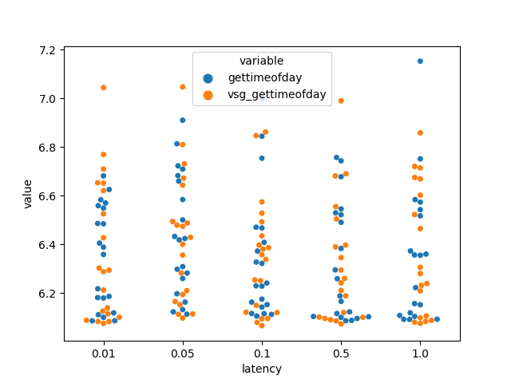

small bench:
```bash
for i in {1..20}; do for i in 1 0.5 0.1 0.05 0.01; do  echo "$i, $(./tansiv examples/benchs/nova_cluster.xml examples/benchs/deployment.xml --socket_name gettimeofday.sock --force $i)" >> gettimeofday.csv ; done; done
```

```python
import pandas as pd
import matplotlib.pyplot as plt
import seaborn as sns

df = pd.read_csv("./gettimeofday.csv")
df.columns = ["latency", "gettimeofday", "vsg_gettimeofday"]
# tidy it
ddf = pd.melt(df, id_vars=["latency"], value_vars=["gettimeofday", "vsg_gettimeofday"])
sns.swarmplot(data=ddf, x="latency", y="value", hue="variable")
plt.show()
```

